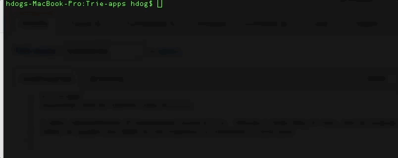

# Trie-apps
Excursions with my favorite data structure

A basic implementation of autocomplete using a Trie.  Provide a large body of text, and the program builds a weighted Trie, 
where the weights are based on the frequency of occurence of each word.  The returned list is sorted by weight in descending order. 

usage: auto-complete.py [-h] -text TEXT -prefix PREFIX [-count COUNT]

arguments:

  -h, --help            show this help message and exit
  
  -text TEXT, -t TEXT   the path to the source text with which we will build
                        the word-frequence trie
                        
  -prefix PREFIX, -p PREFIX
                        the prefix (i.e. key) to the trie
                        
  -count COUNT, -c COUNT
                        the number of words to return in the suggestion list

